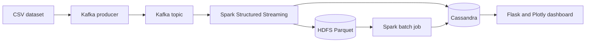

# Pneumonia & Air Quality — Real-Time Big Data Pipeline

A Lambda architecture pipeline that streams patient health records enriched with air-quality measurements, stores them in HDFS and Cassandra, computes a pneumonia risk score per city and displays the results on a real-time dashboard. It was developed as an academic project at the National Engineering School of Tunis (ENIT).

## Architecture



| Layer | Folder | Role |
|---|---|---|
| Data source | `DataSourceLayer` | 60,000 patient records: vital signs, symptoms, chest X-ray label (NORMAL / PNEUMONIA) and air quality of the patient's city (PM2.5, PM10, NO2) |
| Ingestion | `DataIngestionLayer` | Kafka producer that replays the dataset record by record to simulate a real-time stream |
| Speed | `SpeedProcessingLayer` | Spark Structured Streaming job that reads from Kafka and writes each micro-batch to HDFS (Parquet) and Cassandra |
| Batch | `BatchProcessingLayer` | PySpark job that aggregates the full history per city and computes a risk score |
| Serving | `ServingLayer` | Flask dashboard with Plotly charts, reading from Cassandra |

The city risk score combines the pneumonia rate and the average PM2.5 concentration: `0.5 × pneumonia rate + 0.5 × (average PM2.5 / 100)`.

## Tech stack

- **Streaming and processing:** Apache Kafka · Apache Spark 3.1 (Structured Streaming, PySpark)
- **Storage:** Hadoop HDFS · Apache Cassandra
- **Dashboard:** Flask · Plotly · Pandas
- **Infrastructure:** Docker Compose

## Getting started

Prerequisites: Docker Desktop and Python 3.10.

1. Clone the repository:
```bash
   git clone https://github.com/rihem-khouildi/pneumonia-air-quality-pipeline.git
```
2. Start the infrastructure (Zookeeper, Kafka, Cassandra, Spark, HDFS):
```bash
   docker compose up -d
```
3. Create the keyspace and tables with `Cassandra/schema.cql`.
4. Run the Kafka producer (`DataIngestionLayer/Kafka_producer.py`).
5. Submit the streaming job (`SpeedProcessingLayer/streaming_consumer.py`) to Spark.
6. Run the batch job (`BatchProcessingLayer/batchprocessor.py`).
7. Start the dashboard and open `http://localhost:5000`:
```bash
   cd ServingLayer
   pip install -r requirements.txt
   python app.py
```

The Spark master UI is available on port 8080 and the HDFS NameNode UI on port 9870.

## Authors

- **Rihem Khouildi**
- **Maram Dahmen**